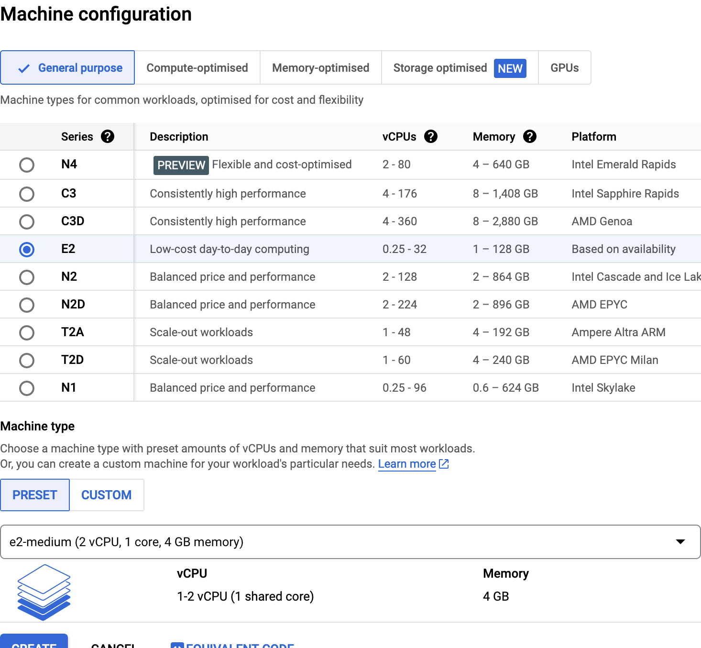
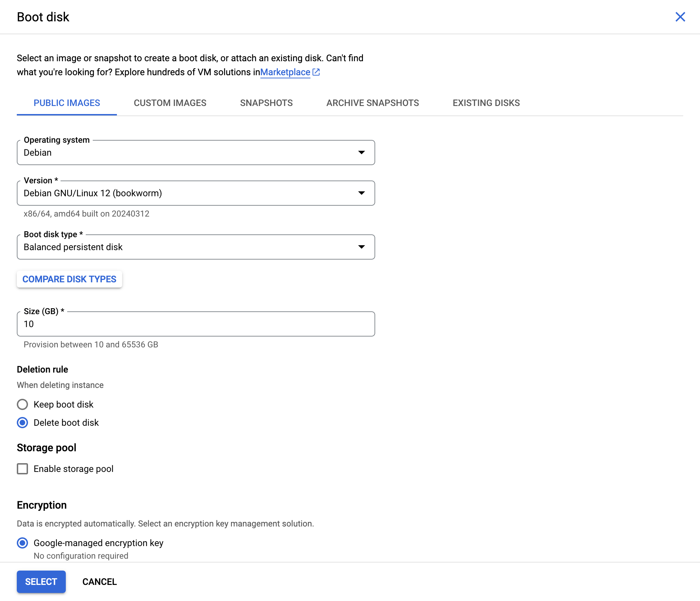
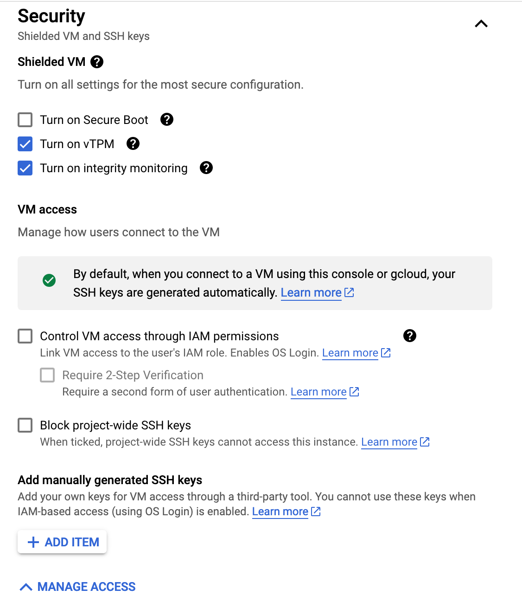
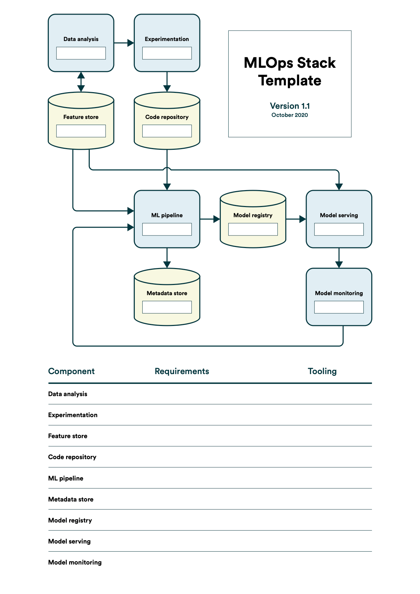

# MLOps Project

In the course project, you will have the opportunity to apply the knowledge you have gained in the course to a real-world problem. For this, we provide you with free credits for Google Cloud Platform, which you can use to set up your MLOps pipeline. You will work in groups of three students. Once you have formed a group, you should follow the instructions in the [`GCP Group Setup Guide`](./create_group.md) to set up your group and redeem your credits.

## Recommended Cloud Setup

You are free to choose the tools and Google Cloud Platform services you want to use, but unless you have experience with GCP, we recommend using a Virtual Machine. This allows you to install the tools you would like to use and run them on the cloud. You can follow the instruction in the [GCP documentation](https://cloud.google.com/compute/docs/instances/create-start-instance#startinginstancewithimage)

### Creating a VM

1. Navigate to the Google Cloud Compute Engine page. When you first open the page, you might have to enable the Compute Engine API. You can do this by clicking on the "Enable Compute Engine API" button.
2. Click on “Create Instance”.
3. Select a name for your instance. 
4. Pick a region and zone. We recommend using a region close to you, anything in Europe will do.
5. Choose a machine type. We recommend using a machine with at least 2 vCPUs and 8GB of memory, but if you intend to run many containers on your machine, you might want to increase the number of vCPUs as well as the memory size. 
6. Select a boot disk by clicking on `Change` and then navigating through the menu. We recommend using an Ubuntu image, but you can select any image you like. Make sure to select a disk size that is large enough for your needs.  
7. In the firewall section, make sure to allow HTTP and HTTPS traffic. 
8. In the “Advanced Options” section, go to “Security”. Here, you can add public SSH keys to your instance. This allows you to connect to your instance via SSH. If you don't have an SSH key yet, you can generate one using the `ssh-keygen` command. You can find instructions on how to create SSH keys [here](https://docs.github.com/en/authentication/connecting-to-github-with-ssh/generating-a-new-ssh-key-and-adding-it-to-the-ssh-agent).
9. Click on “Create” to create your instance. 

Note that on the right-hand side of the page, you can see an estimate of the cost of your instance. Make sure to stop your instance when you are not using it to avoid unnecessary costs!

For everything that goes beyond a simple VM, the Google Cloud Platform documentation is your number one resource for any questions you might have.

> Your total budget is limited to three coupons of $50 each. Make sure to use them wisely! Always stop your resources when you are not using them to avoid unnecessary costs!

## MLOps Tools

As with the cloud setup, you are free to choose the tools you want to use. The tools introduced in the course are a good starting point, but there are many more out there. For an overview over some of the most popular tools, check out [MLOps Toys](https://mlops.toys/) and the [Linux Foundation AI & Data Landscape](https://landscape.lfai.foundation/). Many tools come with instruction on how to set them up in the cloud, so you should be able to find a guide for your tool of choice.

> We cannot provide support for all tools under the sun. We may assist you with the tools we have introduced in the course, but we cannot help you with other tools. Please do not contact the TA or lecturer regarding tools we have not introduced in the course.

In any case, we recommend using the `MLOps Stack Template` to organize your tools. The template is available from [here](https://valohai.com/blog/the-mlops-stack/). Your stack does not have to include all tools in the template.

