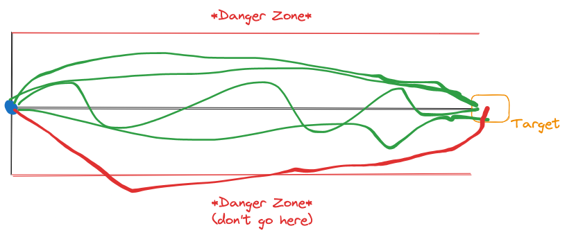
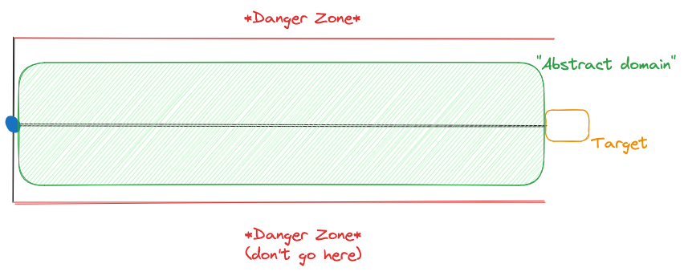

# Verification of Models

So far, we have been _testing_ models. However, tests can never _guarantee_ that a property holds. This is especially problematic when trying to examine the reliability of a neural network in the face of adversarial attacks.
In this final part of the lab, we will introduce you to two _verification_ methods - methods that can guarantee that a neural network has a certain property.

## Formal verification problem statement

The attack we saw in the previous part (and all its friends) may sometimes work well in practice, but provide no formal guarantees.
We want an _automated_ verifier to prove properties of realistic networks.

Given

- a neural network $N$
- a property over inputs $\phi$, called the _pre-condition_
- a property over outputs $\psi$, called a _post-condition_

prove that $\forall i \in I : i \models \phi \implies N(i) \models \psi$ or return a _violation_.

What does this abstract formula mean? For all inputs in some input set $I$, if the input satisfies the pre-condition, it also satisfies the post-condition.
Let's look at the concrete problem of certifying robustness of a binary image classification neural network.

For adversarial robustness, $\phi$ captures the input region. We define this using the "epsilon-ball", a "sphere"  (in some norm) around the an image with radius $\epsilon$.
For example using the $L_\infty$-norm, this the ball around an input $x$ is

$$\operatorname{Ball}(x)_\epsilon = \{x' \in I : \|x - x'\|_\infty < \epsilon\}$$

So, the ball around $x$ is the set of all elements in the input set, which are at a distance less then $\epsilon$ from the input.

$\psi$ captures the property that we want to prove. In the case of adversarial robustness this means that the label of the original and the perturbed sample must remain the same.
As a formula:

$$\psi: \forall j \in \{0, 1\}: j \neq N(i) \implies N(i) > o_j$$

where $o$ denotes the network output pre-softmax.

The question now becomes: How to we prove this property? As $\phi$ can capture an unbounded set of points, one cannot simply enumerate points in $\phi$
and check whether they satisfy $\psi$.

### Formal verification terminology

There are two important concepts in formal verification that we need to introduce here.
There is _soundness_: A method is called _sound_ if upon termination it only states that property holds if the analyzed program (i.e. a neural network)
actually satisfies said property. We refer to these methods as _certification methods_. A method is called _unsound_ if it can state that the property holds
even though it does not. For example, adversarial attacks (and all other test methods) are typically unsound: they miss violations when they exist.

The second important concept is _completeness_: A certification method is _complete_ if it is **always** able to prove that a property holds if it actually holds.
On the other hand, a method is called _incomplete_ if it cannot guarantee that it can prove a property which actually holds.

In the following we will demonstrate two techniques, a sound but incomplete one, and one that is sound and complete

## Incomplete but sound: Certification via bound propagation

Most incomplete methods rely on what is known as _bound propagation_. Starting with the initial pre-condition $\phi$ (remember, this is some region around the input),
we "push" $\phi$ through the network and compute an _over-approximation_ of the effect of each layer.

So, how do we do this? Generally, this is the realm of [Abstract interpretation](https://en.wikipedia.org/wiki/Abstract_interpretation), which is a topic for
a whole lectures series and not a single lab. For neural networks, abstract interpretation generally means finding some convex over-approximation of $\phi$ and a
set of transformations that help apply the neural network to this over-approximation.

### Abstract interpretation: Intuition

Let's assume you are a drone operator and you want to fly your delivery drone (the blue dot) to the target (the orange box) to deliver some parcel.
You know that if you fly into the red zone (the infamous danger zone), you will make some people very angry - and you of course don't want to do that.

For some technical reason that we won't go into detail here, you can't guarantee that the drone will fly the path indicated by the straight black line (maybe there's wind or something, I'm not a drone pilot).
However, if you can guarantee that your drone will always stay close to this line, you are save.

This region around the black line is the abstract domain. It's not perfect, it's an over-approximation as it is clearly wider than the optimal path, but it's still better than no guarantees at all!

### Abstract interpretation with boxes

How does this work for neural networks? Let's say you have a very simple model that takes as input a value $x \in [1, 2]$ and is expected to return a value in $[0, 1]$. In this case, you are not simply picking values from $[1, 2]$.
Instead, you take _all the values_ in the set $[1, 2]$ and check how the model transformers this set as it propagates through the model.

One simple approximation is the _box approximation_. For every value in the input region, we simply use an interval (a "box"). So, if you have an image represented by
a tensor $(c, h, w)$, you additionally get a lower and upper bound for every pixel in this tensor. The rules for propagating this box are very simple:

- Addition: $[a, b] +^\# [c, d] = [a + c, b + d]$
- Negation: $-^\#[a, b] = [-b, -a]$
- ReLU: $ReLU^\#[a, b] = [ReLU(a), ReLU(b)]$
- Scalar multiplication: $\lambda\cdot^\#[a, b] = [\lambda\cdot a, \lambda\cdot b]; (\lambda \geq 0)$

Try box propagation in the [box_transformer.ipynb](./verification/box_transformer.ipynb) notebook!

## Complete, sound, and very expensive: Certification with MILP

What if abstaining (i.e. saying that you can't verify a certain input) is not an option and you _really_ need an answer?
If you have plenty of resources, you can always turn to mixed-integer linear programming!

Linear programs are optimization problems of the form

$\min c^\top x \\ \mathrm{s.t.} \; \mathbf{A}x \leq b \\ x \geq 0$.

where $c$ and $x$ are real vectors and $\mathbf{A}$ is a matrix of coefficients.

We can model (ReLU-based) neural networks using a special kind of linear program: Mixed-integer linear programs.
A mixed integer linear program is a linear program with the added constraint that some variables are integers.

As demonstrated in the seminal paper on this topic, [Evaluating Robustness of Neural Networks with Mixed Integer Programming](https://arxiv.org/pdf/1711.07356.pdf),
piece-wise linear neural networks can be encoded as linear programs.

This approach is complete but comes at a high cost: MILPs are NP-complete, which means that no efficient (in the sense that it runs in polynomial time - read: fast) is known.

---

## Further reading

Here are some additional resources, in case you want to learn more about neural network verification:

- [Introduction to Neural Network Verification](https://verifieddeeplearning.com/), a book.
- [Neural Network Verification Tutorial](https://neural-network-verification.com/), a workshop by the authors of behind `CROWN`, a state-of-the-art neural network verifier.

If you want to try out an implementation of state-of-the-art software, we recommend you take a look at [ERAN](https://github.com/eth-sri/eran), the "ETH Robustness Analyzer for Deep Neural Networks".
Generally, the [Secure, Reliable, and Intelligent Systems (SRI) Lab](https://www.sri.inf.ethz.ch/) that developed ERAN is a good source to follow if you are interested in AI safety.
