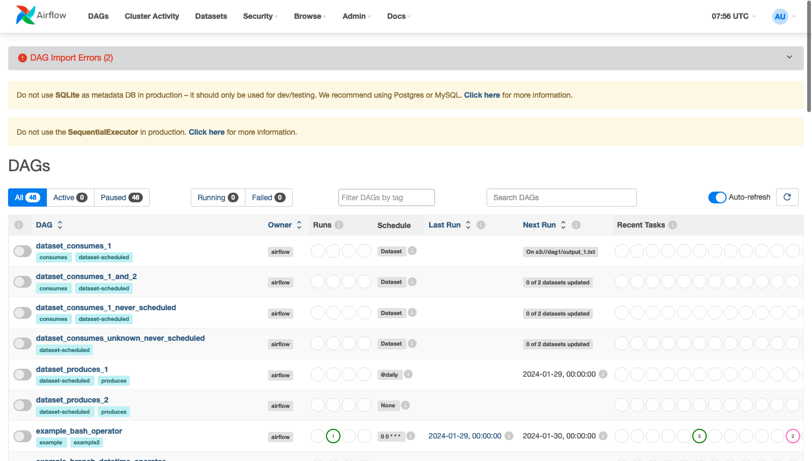
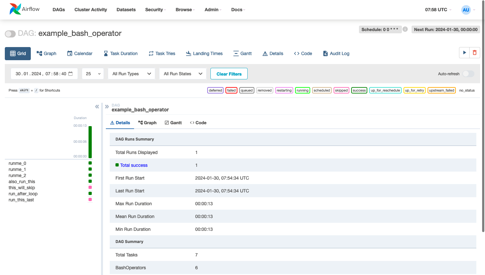

# Venting 101 - A quick introduction to airflow

From the airflow docs:
> Apache Airflow is an open-source platform for developing, scheduling, and monitoring batch-oriented workflows. Airflow’s extensible Python framework enables you to build workflows connecting with virtually any technology. A web interface helps manage the state of your workflows. Airflow is deployable in many ways, varying from a single process on your laptop to a distributed setup to support even the biggest workflows.

In this brief introduction to airflow, we will look at how to write and test airflow pipelines.
Deploying and managing airflow is an art and science of its own, which we invite you to study on your own. :D

## Installing Airflow

An Airflow deployment has many interacting components, which must have the correct versions. This is why installing Airflow is a bit more involved than a simple `pip install apache-airflow`:

```shell
AIRFLOW_VERSION=2.10.5

PYTHON_VERSION="$(python -c 'import sys; print(f"{sys.version_info.major}.{sys.version_info.minor}")')"

CONSTRAINT_URL="https://raw.githubusercontent.com/apache/airflow/constraints-${AIRFLOW_VERSION}/constraints-${PYTHON_VERSION}.txt"

pip install "apache-airflow==${AIRFLOW_VERSION}" --constraint "${CONSTRAINT_URL}"
```

## Airflow in 5 minutes

Airflow is again all about pipelines (DAGs). The main characteristic of Airflow workflows is that everything is defined in python code, so there are no `pipeline.yaml`-specs or similar configuration files - the code _is_ the spec.
"Workflows as code" serves several purposes:

- Dynamic: Airflow pipelines are configured as Python code, allowing for dynamic pipeline generation.
- Extensible: The Airflow™ framework contains operators to connect with numerous technologies. All Airflow components are extensible to easily adjust to your environment.
- Flexible: Workflow parameterization is built-in leveraging the Jinja templating engine. (Although we advise you to **not** use this feature as it will make your DAGs hard to maintain.)

There are four components to Airflow:

- DAG Bag: A folder that holds all DAG scripts.
- Executor: Executors run the tasks that make up a DAG. There are various executor implementations available, starting from simple local executors like the [Sequential Executor](https://airflow.apache.org/docs/apache-airflow/stable/core-concepts/executor/sequential.html) which simply executes all tasks one-by-one in sequential order, to complex distributed ones like the [Kubernetes Executor](https://airflow.apache.org/docs/apache-airflow/stable/core-concepts/executor/kubernetes.html). You can also [write your own executor](https://airflow.apache.org/docs/apache-airflow/stable/core-concepts/executor/index.html#writing-your-own-executor).
- Scheduler: The scheduler triggers workflows (DAGs) and submits its tasks to the executor.
- Web server: Presents a graphical user interface to inspect, trigger, and debug tasks and DAGs.
- Database: Stores metadata, keeps the state of DAGs and tasks.

However, as mentioned in the introduction, managing Airflow is out of scope for this introduction. For us, the local airflow version is enough. You can start it with the following command:

```shell
airflow standalone
```

Note that it matters where you start this command. Airflow will look for DAGs in the current working directory. If you want to start it in a specific directory, you can set the `AIRFLOW_HOME` environment variable to the desired directory. More on this later.

This command initializes the database, creates a user, and starts all the components.
Once that's done, take note of the username and password, you can access the Airflow UI by visiting `localhost:8080`.
Head over to the _DAGs_ tab. It lists all DAGs in the Airflow DAG folder - in this case, all DAGs in the Airflow examples. By default, they are all disabled, as you can tell from the toggle switches on the left hand side of the UI.



Search for the `example_bash_operator`. Enable it by toggling it. It should immediately start running.
If you click on a DAG, a detailed view of the DAG will open.



As you see, there are again plenty of tabs to look at. For instance, the _Graph_ tab provides you with a nicely rendered view of the Airfow DAG.
You can also take a look at how the DAG is implemented in the _Code_ tab.

With this in mind let's take a closer look at how DAGs are implemented. Take a look at the following snippet:

```python
from datetime import datetime

# The DAG object; we'll need this to instantiate a DAG.
from airflow import DAG

# Operators; we need these to define our tasks!
from airflow.decorators import task
from airflow.operators.bash import BashOperator

# A DAG represents a workflow, a collection of tasks
with DAG(dag_id="demo", start_date=datetime(2022, 1, 1), schedule="0 0 * * *") as dag:
    # Tasks are represented as operators
    hello = BashOperator(task_id="hello", bash_command="echo hello")

    # Tasks can also be declared using decorated python functions.
    # This is known as "taskflow".
    @task()
    def airflow():
        print("airflow")

    # Set dependencies between tasks
    hello >> airflow()
```

Here you see the following:

- A [DAG](https://airflow.apache.org/docs/apache-airflow/stable/core-concepts/dags.html) named “demo”, starting on Jan 1st 2022 and running once a day. A DAG is Airflow’s representation of a workflow.
- Two [tasks](https://airflow.apache.org/docs/apache-airflow/stable/core-concepts/tasks.html), a BashOperator running a Bash script and a Python function defined using the `@task` decorator. There are three types of tasks:
  - [Operators](https://airflow.apache.org/docs/apache-airflow/stable/core-concepts/operators.html), predefined task templates that you can string together quickly to build most parts of your DAGs.
  - [Sensors](https://airflow.apache.org/docs/apache-airflow/stable/core-concepts/sensors.html), a special subclass of Operators which are entirely about waiting for an external event to happen.
  - [TaskFlow-decorated](https://airflow.apache.org/docs/apache-airflow/stable/core-concepts/taskflow.html) `@task`s, which are custom Python functions packaged up as a Task.
- \>> between the tasks defines a dependency and controls in which order the tasks will be executed

You can also find this DAG in `lab05/airflow/dags/dag_snippet.py`.
Stop your current `airflow standalone` and change into `lab05/airflow`. Now, restart airflow but this time in the context of your current working directory:

```shell
AIRFLOW_HOME=`pwd` airflow standalone
```

`AIRFLOW_HOME` is root directory for the Airflow content. This is the default parent directory for Airflow assets such as DAGs and logs. If not specified otherwise, Airflow will search `$AIRFLOW_HOME/dags` for DAG files. In our case, this is `lab05/airflow/dags/`, so it will find `dag_snippet.py`.
Once you run the command, you will see a few files being created. Again, log in to airflow. The status of the our little “demo” DAG from above should be visible in the web interface.

This example demonstrated a simple Bash and Python script, but these tasks can run any arbitrary code. Think of running a Spark job, moving data between two buckets, sending an email, training a model, etc.
There's much more to be learnt about Airflow, so we invite you to play with the examples on your own.