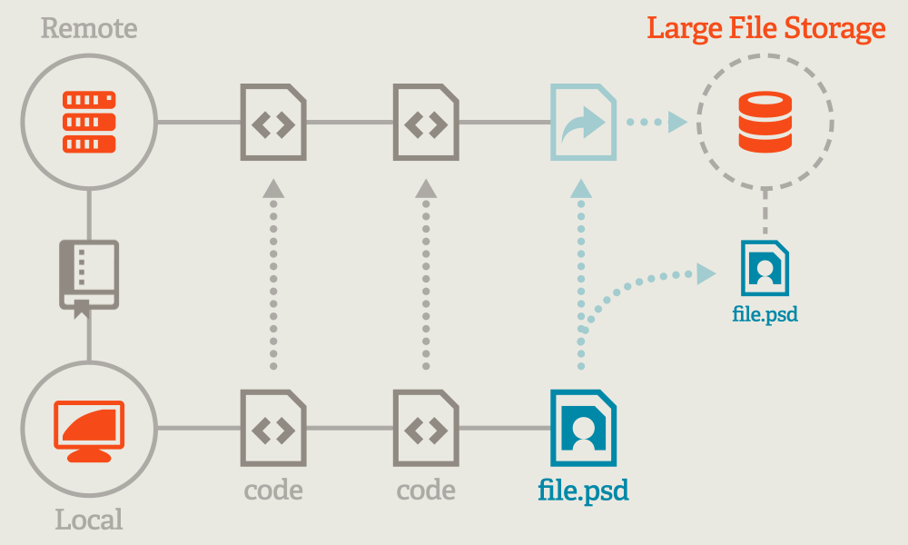

# Git Large File Storage

Git Large File Storage (LFS) is an open source extension for Git that allows you to store large files
in git repositories. LFS achieves this by replacing large files with text pointers inside git while storing the
file contents on a remote server like github.com.



This looks cool, but why is it useful? Why can't we just check big files into a git repository?

Some of Git's internals, the one computing `diff`s between versions and the garbage collector in particular, cannot cope with
large files - and if they can, they tend to require an extraordinary amount of resources.

The horrors don't stop there. Most git servers (GitHub and GitLab included) limit the amount of space a git repository can take up. Even if you do manage to upload your dataset to GitHub, your peers might not be too happy about this: Checking out might take a very long time because `git pull` will download this very big file that you've just added to git. Imagine what happens when you upload a whole dataset or a few model checkpoints!

Now that we have you convinced that naively checking in big files is a bad idea, and that you need Git LFS, let's actually use LFS!

## Getting started

Before you can use Git LFS, you have to install it. For your convenience, we copied the install instruction from
the official git repository.

### Installing

#### On Linux

Debian and RPM packages are available from packagecloud, see the [Linux installation instructions](INSTALLING.md).

#### On macOS

[Homebrew](https://brew.sh) bottles are distributed and can be installed via `brew install git-lfs`.

#### On Windows

Git LFS is included in the distribution of [Git for Windows](https://gitforwindows.org/).
Alternatively, you can install a recent version of Git LFS from the [Chocolatey](https://chocolatey.org/) package manager.

----

Once you have the command line extension installed, open a terminal and set up Git LFS fro your user account.
You do this by running the following command:

```raw
git lfs install
```

Note that you only have to run this once!
Next, we need a git repository and a big file. For the git repository, we ask you to create one on
github.zhaw.ch. For our big file, we will be using [`oxford_flowers102`](https://www.tensorflow.org/datasets/catalog/oxford_flowers102),
a dataset of flowers, which we ask you to download from [here](https://www.robots.ox.ac.uk/%7Evgg/data/flowers/102/). We only need the images.

Once you have downloaded the tarball, create a directory `data` in your new repository and move
the tarball into the `data`.

Checking in the tarball is almost identical to the normal `git` workflow:

First, you have to tell git to use `lfs` to track this file:

```raw
git lfs track data/*.tgz
```

This will create a file called `.gitattributes`. We have to check this file in:

```raw
git add .gitattributes
```

Note that defining the file types Git LFS should track will not, by itself, convert any pre-existing files to Git LFS, such as files on other branches or in your prior commit history. To do that, use the [`git lfs migrate`](https://github.com/git-lfs/git-lfs/blob/main/docs/man/git-lfs-migrate.adoc) command, which has a range of options designed to suit various potential use cases.

Once the steps above are done, you can work with the tarball like any other file.

```raw
git add data/
git commit -m "Add dataset"
git push origin main
```

Note that this will take some time since we are uploading the whole file!

----

You have seen how you can add large files to git, but what does this look like on the other side?
Will `git clone` take ages?

To find out, let's delete your local copy of (yes, you read that right) the repository you have just created, i.e.

```raw
rm -rf path/to/your/git/repo
```

Then, clone it!

```raw
git clone <url of your git repo>
```

This takes ages! It does, and that's why LFS is not
the solution to all our data processing worries.

LFS is useful to add single large files, like a model snapshot, but
it won't scale to datasets.

In the next part, we will take a look at `DVC`, a system built on top of Git that
allows you to use any cloud storage to store your data and while keeping
references in Git.
